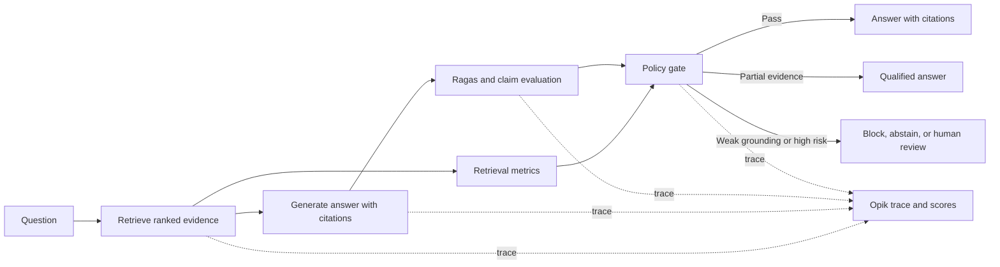
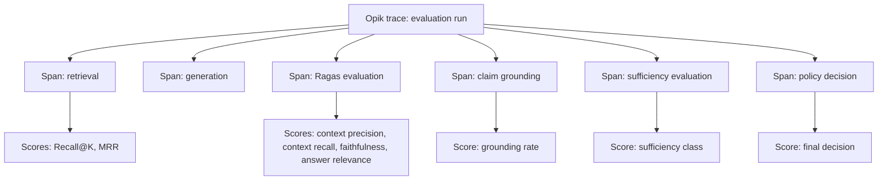

# Chapter 4 implementation plan

## Purpose

Build a runnable companion repository for Chapter 4, **Debugging hallucinations with math**, from *The Write Path*. The project must demonstrate how a RAG system moves from an answer that merely sounds plausible to an answer that can be measured, traced, blocked, qualified, or escalated.

The supported first path is cloud-first:

- **Ollama Cloud** supplies the generator and, where suitable, the LLM judge.
- **Opik Cloud** supplies tracing, datasets, experiments, scores, and production-style monitoring.
- **Ragas** supplies the Chapter 4 metric vocabulary: context precision, context recall, faithfulness, and answer relevance.
- Classical retrieval metrics and claim-level checks fill gaps that a single aggregate score cannot explain.

Do not copy, adapt, or use code, prompts, datasets, or file layouts from `sourangshupal` repositories. Code may be reused from the owner’s repositories, especially `mohitagr18/rag-qa-ragas` and `mohitagr18/rag-evaluation`, after verifying that the reused code works with pinned dependency versions. Record the source path and commit SHA for any reused implementation in `docs/reuse_ledger.md`.

## What the completed system proves

The completed repository must answer five different questions separately:

1. Did retrieval find and rank the needed evidence?
2. Was the retrieved evidence relevant and sufficient?
3. Did the generated answer remain supported by that evidence?
4. Did the answer address the question and match expected facts?
5. Given the evidence and scores, should the system answer, qualify the answer, abstain, block, or request human review?

Do not collapse those questions into a single “RAG quality” score.



## Required services and secrets

The owner already has an Ollama Cloud API key and an Opik API key. No additional paid provider key is required for the first version. Never commit real values.

Create `.env.example` containing only placeholders:

```dotenv
OLLAMA_API_KEY=
OLLAMA_BASE_URL=https://api.ollama.com
OLLAMA_MODEL=
OLLAMA_JUDGE_MODEL=

OPIK_API_KEY=
OPIK_URL_OVERRIDE=
OPIK_PROJECT_NAME=ch04-debugging-hallucinations-math
OPIK_WORKSPACE=

HF_TOKEN=
LOG_LEVEL=INFO
```

Notes:

- Confirm the correct Ollama Cloud endpoint and model identifiers from the owner’s existing working configuration before hard-coding either value.
- Confirm the current Opik Cloud endpoint and required environment-variable names against current Opik documentation before implementation. `OPIK_URL_OVERRIDE` should remain blank when the SDK default is correct.
- `HF_TOKEN` remains optional. Use it only if a retrieval or embedding dependency requires a gated Hugging Face model.
- The first release must run without OpenAI, Anthropic, Gemini, Langfuse, MLflow, or any other provider key.

## Project layout

```text
ch04-debugging-hallucinations-math/
├── README.md
├── IMPLEMENTATION_PLAN.md
├── pyproject.toml
├── uv.lock
├── .env.example
├── .gitignore
├── results.md
├── data/
│   ├── source/
│   │   └── sample_policy_corpus.md
│   ├── golden/
│   │   └── golden_dataset_small.csv
│   └── artifacts/
│       ├── retrieval_runs.jsonl
│       ├── evaluation_results.jsonl
│       └── scorecard.csv
├── notebooks/
│   └── 01_rag_metrics_deep_dive.ipynb
├── src/
│   └── ch04_eval/
│       ├── __init__.py
│       ├── config.py
│       ├── schemas.py
│       ├── ingest.py
│       ├── retrieval.py
│       ├── generation.py
│       ├── evaluation.py
│       ├── grounding.py
│       ├── policy_gate.py
│       ├── tracing.py
│       └── reporting.py
├── scripts/
│   ├── ingest_corpus.py
│   ├── run_demo.py
│   ├── run_evaluation.py
│   ├── calibrate_thresholds.py
│   └── export_scorecard.py
├── tests/
│   ├── test_retrieval_metrics.py
│   ├── test_grounding_policy.py
│   ├── test_evaluation_schema.py
│   └── test_smoke_demo.py
├── workflow/
│   ├── 01_evaluation_layers.mmd
│   ├── 02_opik_trace_and_score_flow.mmd
│   ├── 03_policy_gate.mmd
│   └── 04_threshold_calibration.mmd
└── docs/
    ├── chapter_mapping.md
    └── reuse_ledger.md
```

Use `uv` for dependency management. Users must be able to run `uv sync` after placing their keys in `.env`. Keep the project source under `src/`. Keep all outcome documentation in one root-level `results.md`.

## Build sequence

### Phase 0: inspect reusable owner code

Inspect `mohitagr18/rag-qa-ragas` and `mohitagr18/rag-evaluation` before writing new implementation. Identify:

- Existing configuration and environment conventions.
- Golden dataset schema and question fixture patterns.
- Ragas versions and metric calls.
- Existing retrieval and generation abstractions.
- Notebook cells that are clear enough to retain as teaching material.

Reuse only what is compatible with pinned versions. Add each reused file, function, or concept to `docs/reuse_ledger.md`, including original repository, path, and source commit SHA.

### Phase 1: bootstrap

1. Create a `uv` Python project.
2. Add a strict `.gitignore` for `.env`, notebooks checkpoints, Python caches, generated artifacts, and local data that should not be committed.
3. Add `pyproject.toml` with production and development dependency groups.
4. Add `.env.example`.
5. Add a small Markdown source corpus and a 10 to 15 row golden dataset.
6. Add a configuration module that validates required cloud settings only when a cloud-backed operation is requested.

Suggested dependencies, subject to compatibility validation:

- `ragas`
- `opik`
- `pydantic` and `pydantic-settings`
- `pandas`
- `pytest`
- `pytest-asyncio` if required
- a current Ollama Python client compatible with Ollama Cloud
- the chosen local or hosted vector search dependency
- optional `sentence-transformers` or Hugging Face components only when required

Do not pin versions until the local agent verifies a working compatible set. After verification, commit both `pyproject.toml` and `uv.lock`.

### Phase 2: evaluation corpus and golden dataset

Use a small policy-style corpus that is safe to commit and easy to audit. It should include current information, a superseded rule, a conflicting rule, and content that is intentionally insufficient for at least one question.

Create `data/golden/golden_dataset_small.csv` with these columns:

```text
id
question
expected_answer
expected_facts
relevant_document_ids
risk_tier
should_answer
notes
```

Use low, medium, and high risk tiers. The 10 to 15 cases must include:

- An answerable question whose supporting document ranks late unless retrieval works well.
- A question whose answer is exposed to stale-policy confusion.
- A question with conflicting evidence.
- A question that is out of corpus and must trigger abstention.
- A question designed to tempt an unsupported but plausible claim.
- A partially answerable question that must produce a qualified answer rather than a complete assertion.

Do not use a benchmark containing only easy, answerable questions.

### Phase 3: retrieval and deterministic metrics

Implement `ingest.py` and `retrieval.py` first. Retrieval output must be structured and retained for evaluation:

```json
{
  "query": "...",
  "retrieved_chunks": [
    {
      "document_id": "policy-2026-01",
      "chunk_id": "policy-2026-01#003",
      "text": "...",
      "rank": 1,
      "retrieval_score": 0.0,
      "retrieval_method": "..."
    }
  ],
  "corpus_version": "..."
}
```

Start with the simplest retriever compatible with the owner’s existing code. The first goal is an evaluable baseline, not hybrid-retrieval feature work. Hybrid retrieval, BGE-M3, ColBERT, and Qdrant belong primarily to Chapter 3 unless the new code is needed solely to show how Chapter 4 evaluates an already-built retriever.

Calculate deterministic metrics using `relevant_document_ids`:

- Recall@K
- Precision@K
- Mean reciprocal rank, MRR
- nDCG only if relevance grades are introduced

Unit test these calculations with fixed fixtures.

### Phase 4: generation with Ollama Cloud

Implement `generation.py` using the owner’s Ollama Cloud configuration. The generation prompt must require:

- Answers constrained to retrieved context.
- Explicit citation references to `document_id` and `chunk_id`.
- A statement of uncertainty when context is incomplete.
- No external facts.

Return a structured object:

```json
{
  "answer": "...",
  "citations": ["policy-2026-01#003"],
  "model": "...",
  "prompt_version": "..."
}
```

Keep the provider implementation isolated so the model can later be switched without rewriting evaluation code.

### Phase 5: core evaluation

Implement these layers separately.

#### A. Ragas metrics

Use the current Ragas APIs to calculate:

- Context precision.
- Context recall.
- Faithfulness.
- Answer relevance.

Metric names and imports change between Ragas releases. Verify the active API against installed documentation and write an adapter in `evaluation.py`. Do not spread Ragas API calls across unrelated modules.

#### B. Claim-level grounding

Implement `grounding.py`. Split the generated answer into atomic claims, then use a judge model to classify each claim against retrieved chunks:

```text
SUPPORTED
UNSUPPORTED
CONTRADICTED
NOT_APPLICABLE
```

Require structured output:

```json
{
  "claim": "The filing deadline is 90 days.",
  "verdict": "SUPPORTED",
  "evidence_chunk_ids": ["policy-2026-01#003"],
  "rationale": "The evidence explicitly states a 90-day deadline."
}
```

Compute:

```text
claim_grounding_rate = supported_claims / (supported_claims + unsupported_claims + contradicted_claims)
```

The judge should use Ollama Cloud initially. Record the judge model and prompt version on every result.

#### C. Evidence sufficiency

Use a separate judge prompt to classify the retrieved evidence for the question:

```text
SUFFICIENT
PARTIAL
INSUFFICIENT
CONFLICTING
```

This score prevents the system from treating a grounded but incomplete answer as safe.

#### D. Reference correctness

Where `expected_answer` or `expected_facts` exists, calculate a correctness score or structured pass/fail assessment. Keep it separate from faithfulness. An answer can be faithful to retrieved material and still be incomplete, stale, or wrong for the question.

### Phase 6: policy gate and threshold calibration

Implement `policy_gate.py` as deterministic, configuration-driven logic. It consumes structured metrics and never calls an LLM itself.

Initial values are placeholders, not universal standards:

```python
RECALL_AT_5_MIN = 0.90
CONTEXT_PRECISION_MIN = 0.75
FAITHFULNESS_MIN = 0.90
ANSWER_RELEVANCY_MIN = 0.80
CLAIM_GROUNDING_MIN = 0.95
```

Example policy:

```python
if evidence_sufficiency in {"INSUFFICIENT", "CONFLICTING"}:
    decision = "ABSTAIN"
elif risk_tier == "high" and claim_grounding_rate < 0.98:
    decision = "HUMAN_REVIEW"
elif risk_tier == "high" and faithfulness < 0.95:
    decision = "HUMAN_REVIEW"
elif claim_grounding_rate < CLAIM_GROUNDING_MIN:
    decision = "BLOCK"
elif evidence_sufficiency == "PARTIAL":
    decision = "QUALIFIED_ANSWER"
else:
    decision = "ANSWER"
```

Every decision must include:

```text
decision
decision_reason
metrics_used
threshold_version
corpus_version
evaluation_run_id
```

Implement `scripts/calibrate_thresholds.py` to produce threshold tables from the golden dataset and human-label columns when available. The script should report false-pass and false-block counts by risk tier. It must not claim that a threshold is validated until human review data exists.

### Phase 7: Opik Cloud observability

Use Opik as the only supported observability platform in version one. Instrument the full request as a trace with nested spans:



At minimum, attach these attributes to the trace or relevant spans:

- Golden-case ID and question.
- Corpus version and configuration version.
- Retrieved document IDs, chunk IDs, ranks, and scores.
- Generator model, judge model, and prompt versions.
- Answer and citations.
- Ragas metrics, deterministic metrics, grounding rate, sufficiency class, and correctness assessment.
- Policy decision and reason.
- Latency and token/cost data where the provider exposes it.

Use dataset and experiment support in Opik for offline runs. Group results by `evaluation_run_id`, retriever configuration, generator model, judge model, and threshold version.

Tracing failures must not cause the RAG request to fail. Make Opik initialization optional behind `OPIK_ENABLED=true`, but enable it by default when a valid API key is present.

### Phase 8: scripts, notebook, and documentation

Provide these commands in the README:

```bash
uv sync
cp .env.example .env
# Add OLLAMA_API_KEY and OPIK_API_KEY to .env
uv run python scripts/ingest_corpus.py
uv run python scripts/run_demo.py
uv run python scripts/run_evaluation.py
uv run python scripts/calibrate_thresholds.py
uv run python scripts/export_scorecard.py
uv run pytest
```

The demo must show one of each result type:

- `ANSWER`
- `QUALIFIED_ANSWER`
- `ABSTAIN`
- `BLOCK` or `HUMAN_REVIEW`

The notebook is explanatory only. It must import the application code from `src/ch04_eval` rather than reimplementing business logic. It should show one failing example from retrieval through final policy decision.

Place Mermaid source files in `workflow/`. Include diagrams for evaluation layers, Opik trace flow, policy gating, and threshold calibration.

`results.md` is the single consolidated results document. Include actual command output after the agent runs the system, plus a scorecard table such as:

| Case | Recall@5 | Context precision | Faithfulness | Grounding | Sufficiency | Decision |
|---|---:|---:|---:|---:|---|---|
| Answerable low-risk | actual | actual | actual | actual | sufficient | answer |
| Partial evidence | actual | actual | actual | actual | partial | qualified answer |
| Out of corpus | actual | actual | n/a | n/a | insufficient | abstain |
| Unsupported claim | actual | actual | actual | actual | sufficient | block or review |

Never invent the actual values in `results.md`. Run the pipeline and record the output.

## Test requirements

Implement tests before declaring the repository complete:

- Fixed-fixture tests for Recall@K, Precision@K, MRR, and nDCG if implemented.
- Validation tests for evaluation and trace schemas.
- A fabricated unsupported claim must receive `UNSUPPORTED` and trigger `BLOCK` or `HUMAN_REVIEW` under the policy.
- An insufficient-evidence high-risk question must return `ABSTAIN`.
- A partial-evidence low-risk question must return `QUALIFIED_ANSWER`.
- A smoke test must run without live cloud calls by using fixtures or dependency injection.
- A separate opt-in integration test may call Ollama Cloud and Opik, and must be skipped unless required environment variables are present.

## Definition of done

The repository is ready when:

- `uv sync` succeeds from a clean checkout.
- The small dataset runs end to end using Ollama Cloud.
- Opik shows one trace per evaluation case with nested retrieval, generation, evaluation, grounding, sufficiency, and policy spans.
- The scorecard distinguishes retrieval failure, insufficient evidence, unsupported claims, and answer-quality failures.
- The policy gate produces answer, qualified answer, abstain, block, and/or human-review decisions predictably.
- Tests pass without requiring live cloud credentials.
- `results.md` contains actual, reproducible run outputs.
- No secrets, generated personal data, or unreviewed third-party code are committed.

## Scope boundaries

This is Chapter 4. Keep it focused on measuring and gating an existing RAG pipeline.

- Do not rebuild the Chapter 3 retrieval architecture unless a small retrieval adapter is required to evaluate it.
- Do not build Chapter 5 CRAG, SR-RAG, recursive rewriting, or corrective routing. The Chapter 4 policy gate may abstain or request human review, but it must not mutate queries or repair retrieval automatically.
- Do not add Langfuse, MLflow, Phoenix, DeepEval, TruLens, RAGChecker, or ARES to the first implementation. Mention them in the README only as alternatives or future extensions.
- Do not add a web UI until the CLI path, tests, traces, and scorecard are working.

## Decisions already made

- Monitoring platform: Opik Cloud.
- Generator and judge provider: Ollama Cloud, subject to available model capabilities.
- Primary evaluation vocabulary: Ragas.
- Evaluation strategy: small, auditable golden dataset first.
- Results documentation: one root-level `results.md`.
- Diagrams: Mermaid source in `workflow/`.
- Dependency manager: `uv`.
- External code policy: reuse from `mohitagr18` is permitted; use from `sourangshupal` is prohibited.
