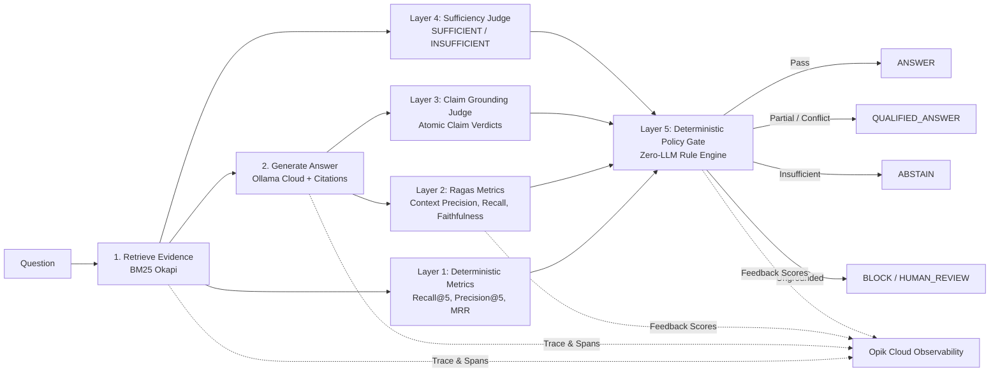

# Chapter 4: Debugging Hallucinations with Math
Companion repository for Chapter 4 of *The Write Path*.

This project demonstrates how an enterprise RAG system moves from an answer that merely *sounds* plausible to an answer that can be measured, mathematically verified, traced in **Opik Cloud**, and deterministically gated.

---

## Architecture: The 5 Measurement Layers

Rather than collapsing evaluation into a single opaque quality score, the system separates measurement into five distinct layers:



---

## Quickstart

### 1. Prerequisites
- Python 3.11+
- [`uv`](https://docs.astral.sh/uv/) for package and environment management
- An **Ollama Cloud** API key & **Opik Cloud** API key

### 2. Setup Environment
```bash
git clone https://github.com/mohitagr18/ch04-debugging-hallucinations-math.git
cd ch04-debugging-hallucinations-math
cp .env.example .env
# Edit .env with your OLLAMA_API_KEY and OPIK_API_KEY
uv sync
```

### 3. Run Pipeline Scripts
```bash
# Ingest and inspect the policy corpus (23 chunks across 10 documents)
uv run python scripts/ingest_corpus.py

# Run the interactive demo showing all 4 policy gate outcomes
uv run python scripts/run_demo.py

# Execute full multi-layer evaluation and stream traces to Opik Cloud
uv run python scripts/run_evaluation.py

# Evaluate policy threshold calibration matrices
uv run python scripts/calibrate_thresholds.py

# Export evaluation scorecard to CSV (data/artifacts/scorecard.csv)
uv run python scripts/export_scorecard.py

# Run complete test suite (unit tests + live cloud tests)
uv run pytest
```

---

## Evaluation Benchmark & Golden Dataset

The golden evaluation benchmark (`data/golden/golden_dataset_small.csv`) evaluates 12 rigorous enterprise policy cases:

| Case ID | Risk Tier | Scenario / Test Focus | Target Outcome |
|---|---|---|---|
| `case-001` | Low | Core Remote Hours | `ANSWER` |
| `case-002` | Low | 24/7 Ethics Hotline | `ANSWER` |
| `case-003` | Medium | **Stale Policy**: Superseded 2024 vs Active 2026 Per Diem | `ANSWER` (Rejects 2024) |
| `case-004` | Medium | **Conflicting Evidence**: Field Hardware vs General Stipend | `ANSWER` (Exception cited) |
| `case-005` | Medium | **Out-of-Corpus**: Paid Parental Leave Duration | `ABSTAIN` |
| `case-006` | High | **Tempting Hallucination**: Pet Insurance Reimbursement | `ABSTAIN` |
| `case-007` | Low | **Partial Evidence**: International Flight Class Rules | `ABSTAIN` / `QUALIFIED_ANSWER` |
| `case-008` | High | **Compliance Deadline**: Severity 1 60-min Notification | `ANSWER` |
| `case-009` | High | **Data Protection**: 7-Year PII Retention & 48h Erasure | `ANSWER` |
| `case-010` | Medium | **Multi-condition**: Moonlighting Restrictions | `ANSWER` |
| `case-011` | High | **Unsupported Inference**: VP CapEx Signing Limits | `ABSTAIN` / `BLOCK` |
| `case-012` | Medium | **Boundary Limit**: 30-Day Window & 60-Day Forfeiture | `ANSWER` |

---

## Live Opik Cloud Observability

Every execution is logged as an Opik trace with **6 nested spans** and **6 numeric metric dimensions**:
- **Traces**: Input query, golden facts, generator answer, policy decision, and rationale
- **Nested Spans**: `span_retrieval`, `span_generation`, `span_ragas_evaluation`, `span_claim_grounding`, `span_sufficiency_evaluation`, `span_policy_gate`
- **Feedback Scores**: `recall_at_5`, `mrr`, `context_precision`, `faithfulness`, `answer_relevance`, `claim_grounding_rate`

---

## Project Structure

```text
ch04-debugging-hallucinations-math/
├── README.md                                 # Overview and execution instructions
├── IMPLEMENTATION_PLAN.md                    # Detailed architectural plan
├── pyproject.toml                            # Pinned uv project dependencies
├── results.md                                # Single consolidated scorecard report
├── data/
│   ├── source/sample_policy_corpus.md        # 10 policy documents (23 chunks)
│   ├── golden/golden_dataset_small.csv       # 12 golden test cases across risk tiers
│   └── artifacts/                            # Evaluation output dumps (JSONL/CSV)
├── notebooks/
│   └── 01_rag_metrics_deep_dive.ipynb        # Step-by-step educational walkthrough
├── src/ch04_eval/
│   ├── config.py                             # Pydantic settings & validation
│   ├── schemas.py                            # Pydantic models & enums
│   ├── ingest.py                             # Markdown corpus ingestion
│   ├── retrieval.py                          # Okapi BM25 retriever & ranking math
│   ├── generation.py                         # Ollama Cloud generator with citations
│   ├── grounding.py                          # Atomic claim judge & sufficiency judge
│   ├── policy_gate.py                        # Deterministic rule engine & thresholds
│   ├── evaluation.py                         # Ragas metric adapter & orchestrator
│   └── tracing.py                            # Opik Cloud trace & span manager
├── scripts/
│   ├── ingest_corpus.py                      # Corpus ingestion CLI
│   ├── run_demo.py                           # 4-decision demonstration
│   ├── run_evaluation.py                     # Full evaluation runner & Opik upload
│   ├── calibrate_thresholds.py               # Threshold calibration matrix
│   └── export_scorecard.py                   # Scorecard CSV exporter
├── tests/                                    # 36 automated unit & integration tests
├── workflow/                                 # Mermaid architecture diagrams
└── docs/
    ├── chapter_mapping.md                    # Book concept to code mapping
    └── reuse_ledger.md                       # Compliance & source attribution ledger
```
