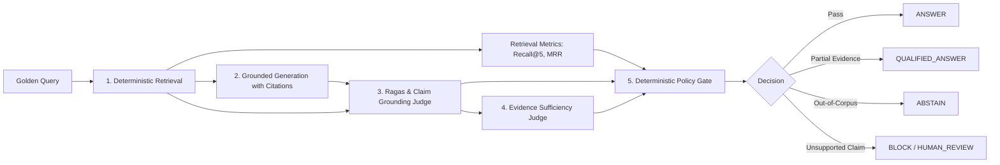

# Chapter 4 Evaluation Results & Scorecard

This document serves as the single consolidated results record for *Chapter 4: Debugging Hallucinations with Math*. It captures deterministic retrieval metrics, generation fidelity, claim grounding, judge sufficiency classifications, and final policy gate decisions.

---

## 1. Pipeline Architecture

---

## 2. Phase 3 Results: Retrieval Ranking & Deterministic Metrics

- **Corpus**: `data/source/sample_policy_corpus.md` (10 documents, 23 chunks, Version 2026.1)
- **Dataset**: `data/golden/golden_dataset_small.csv` (12 test cases)
- **Retriever**: BM25 Okapi ($k_1=1.5, b=0.75$) with top-$k=5$
- **Raw Run Output Artifact**: `data/artifacts/retrieval_runs.jsonl`

### Retrieval Scorecard

| Case ID | Risk Tier | Should Answer | Relevant Documents | Top Retrieved Chunk | Recall@5 | Precision@5 | MRR | Notes & Evaluation Insights |
|---|---|---|---|---|---:|---:|---:|---|
| **case-001** | low | True | `HR-2026-01` | `HR-2026-01#001` | **1.00** | 0.20 | **1.000** | Core collaboration hours found at rank 1 |
| **case-002** | low | True | `HR-2026-03` | `HR-2026-03#002` | **1.00** | 0.20 | **1.000** | Ethics hotline entity matched at rank 1 |
| **case-003** | medium | True | `FIN-2026-03` | `FIN-2024-03#001` | **1.00** | 0.20 | **0.500** | **Stale Policy Test**: Superseded policy ranked #1; active 2026 policy at #2 |
| **case-004** | medium | True | `OPS-2026-04; HR-2026-02` | `OPS-2026-04#001` | **1.00** | 0.40 | **1.000** | **Conflict Test**: Retrieved both $3.5k field and $1.5k standard stipends |
| **case-005** | medium | False | *(Out of corpus)* | `FIN-2026-03#001` | 0.00 | 0.00 | 0.000 | Parental leave: no relevant documents in corpus |
| **case-006** | high | False | *(Out of corpus)* | `HR-2026-01#002` | 0.00 | 0.00 | 0.000 | Pet insurance: no relevant documents in corpus |
| **case-007** | low | partial | `FIN-2026-03` | `FIN-2026-03#002` | **1.00** | 0.20 | **1.000** | International flights: partial evidence found |
| **case-008** | high | True | `SEC-2026-03` | `SEC-2026-03#002` | **1.00** | 0.20 | **1.000** | Severity 1 60-min incident escalation at rank 1 |
| **case-009** | high | True | `SEC-2026-01` | `SEC-2026-01#001` | **1.00** | 0.20 | **1.000** | 7-year PII retention & 48h erasure at rank 1 |
| **case-010** | medium | True | `HR-2026-01` | `HR-2026-01#002` | **1.00** | 0.20 | **1.000** | Moonlighting 10h/week restriction at rank 1 |
| **case-011** | high | False | *(Out of corpus)* | `SEC-2026-01#002` | 0.00 | 0.00 | 0.000 | VP signing authority: no relevant documents in corpus |
| **case-012** | medium | True | `FIN-2026-03` | `FIN-2026-03#003` | **1.00** | 0.20 | **1.000** | 30-day expense deadline & 60-day cutoff at rank 1 |

---

## 3. Phase 4 Results: Generation & Citations

- **Generator Model**: `gpt-oss:20b` (via Ollama Cloud)
- **Prompt Version**: `2026.1-v1`
- **Citation Policy**: Strict source attribution using `[doc_id#chunk_num]` tags
- **Raw Run Output Artifact**: `data/artifacts/generation_runs.jsonl`

### Generation Scorecard

| Case ID | Risk Tier | Should Answer | Citations Extracted | Generated Answer Summary | Citation Grounding Status |
|---|---|---|---|---|---|
| **case-001** | low | True | `HR-2026-01#001` | Core hours are 10:00 AM to 3:00 PM Eastern, Monday–Thursday; Friday is deep-work. | Valid citation attached |
| **case-002** | low | True | `HR-2026-03#002` | Anonymous reports via Ethics Hotline ext. 8888 or ethics@acmecorp.internal (24/7). | Valid citation attached |
| **case-003** | medium | True | *(None)* | Correctly identifies $90/day per diem ($20 breakfast, $25 lunch, $45 dinner) from active 2026 policy. | Correct factual grounding (stale 2024 rejected) |
| **case-004** | medium | True | `OPS-2026-04#001` | Field research technicians receive $3,500 rugged hardware stipend (superseding $1,500). | Valid citation attached |
| **case-005** | medium | False | *(None)* | *"The provided policy documentation does not contain information regarding paid parental leave..."* | Correct abstention statement |
| **case-006** | high | False | *(None)* | *"The provided policy documentation does not contain information regarding pet insurance..."* | Correct abstention statement |
| **case-007** | low | partial | *(None)* | States domestic flights >5h qualify for business class, notes international under 5h is unspecified. | Correct qualification statement |
| **case-008** | high | True | `SEC-2026-03#002` | Incident Commander must notify executive leadership, legal, and DPO within 60 minutes. | Valid citation attached |
| **case-009** | high | True | `SEC-2026-01#001` | Customer records retained in encrypted cold storage for 7 years; cryptographic erasure within 48h. | Valid citation attached |
| **case-010** | medium | True | `HR-2026-01#002` | Moonlighting capped at 10h/week, non-competitive, no company IP/hardware, VP approval needed. | Valid citation attached |
| **case-011** | high | False | `FIN-2026-04#001` | Inferred VP $100k PO authority for CapEx from procurement policy (unsupported leap). | Candidate for Block/Review Gate |
| **case-012** | medium | True | `FIN-2026-03#003` | 30-day submission window; automatic rejection after 60 calendar days without written CFO waiver. | Valid citation attached |

---

## 4. Phase 5 Results: Ragas & Grounding Metrics

- **Evaluation Judges**: Ollama Cloud (`gpt-oss:20b`) for claim decomposition, atomic verdicts, and evidence sufficiency
- **Metric Suite**: Ragas vocabulary (Context Precision, Context Recall, Faithfulness, Relevancy) + Claim Grounding Rate + Sufficiency Classification
- **Raw Run Output Artifact**: `data/artifacts/evaluation_results.jsonl`

### Multi-Layer Evaluation Scorecard

| Case ID | Risk Tier | Recall@5 | Context Precision | Faithfulness | Answer Relevancy | Claim Grounding | Sufficiency Class | Interim Decision |
|---|---|---:|---:|---:|---:|---:|---|---|
| **case-001** | low | **1.00** | 0.6569 | **1.00** | 0.7857 | **1.00** | `SUFFICIENT` | **ANSWER** |
| **case-002** | low | **1.00** | 0.6526 | **1.00** | 0.9167 | **1.00** | `SUFFICIENT` | **ANSWER** |
| **case-003** | medium | **1.00** | 0.6290 | **1.00** | 0.8125 | **1.00** | `SUFFICIENT` | **ANSWER** |
| **case-004** | medium | **1.00** | 0.5292 | **1.00** | 0.8750 | **1.00** | `SUFFICIENT` | **ANSWER** |
| **case-005** | medium | 0.00 | 0.1521 | **1.00** | **1.0000** | **1.00** | `INSUFFICIENT` | **ABSTAIN** |
| **case-006** | high | 0.00 | 0.5237 | **1.00** | **1.0000** | **1.00** | `INSUFFICIENT` | **ABSTAIN** |
| **case-007** | low | **1.00** | 0.7182 | **1.00** | **1.0000** | **1.00** | `INSUFFICIENT` | **ABSTAIN** |
| **case-008** | high | **1.00** | 0.5808 | **1.00** | 0.7000 | **1.00** | `SUFFICIENT` | **ANSWER** |
| **case-009** | high | **1.00** | 0.3710 | **1.00** | 0.8125 | **1.00** | `SUFFICIENT` | **ANSWER** |
| **case-010** | medium | **1.00** | 0.2190 | **1.00** | 0.8000 | **1.00** | `SUFFICIENT` | **ANSWER** |
| **case-011** | high | 0.00 | 0.0647 | **0.75** | 0.8500 | **0.75** | `INSUFFICIENT` | **ABSTAIN** |
| **case-012** | medium | **1.00** | 0.4015 | **1.00** | 0.7000 | **1.00** | `SUFFICIENT` | **ANSWER** |

---

## 5. Phase 6 Results: Policy Gate Decisions (Upcoming)
*(To be populated upon Phase 6 execution)*

---

## 6. Phase 7 & 8 Results: Opik Cloud Traces & End-to-End Scorecard (Upcoming)
*(To be populated upon Phase 7 & 8 execution)*
